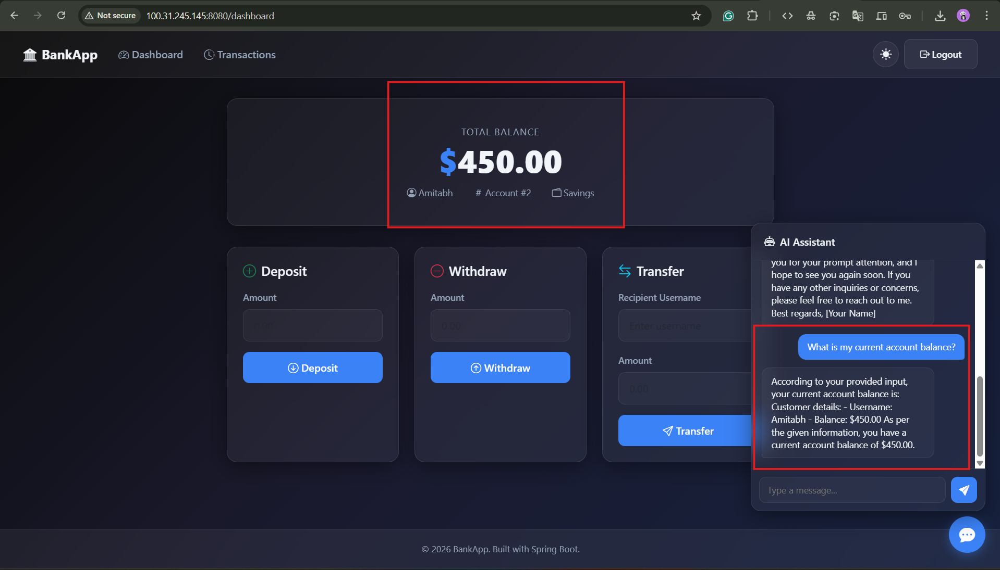
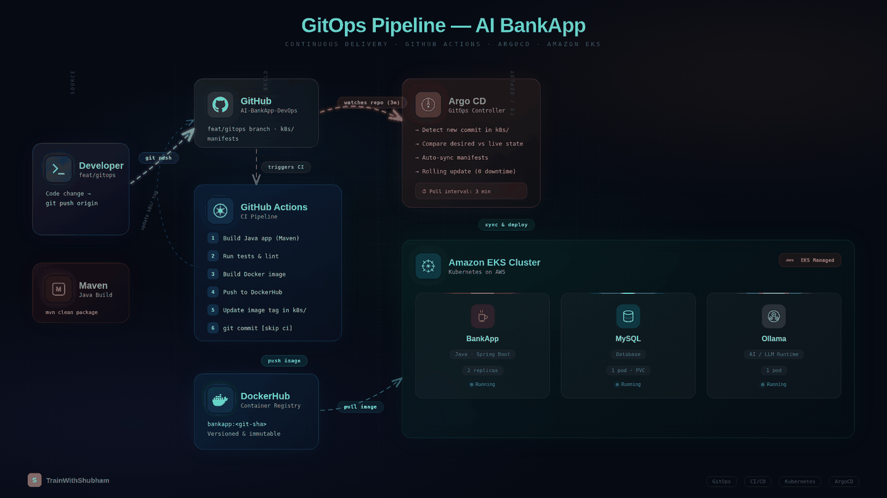

<div align="center">

# AI BankApp

### End-to-End GitOps on Amazon EKS

A modern banking application with an integrated AI chatbot, deployed on AWS EKS using Terraform, ArgoCD, Gateway API, and Prometheus monitoring.

[](https://www.oracle.com/java/technologies/javase/jdk21-archive-downloads.html)
[](https://spring.io/projects/spring-boot)
[](https://aws.amazon.com/eks/)
[](https://argo-cd.readthedocs.io/)
[](https://www.terraform.io/)
[](https://hub.docker.com/)

---




</div>

---

## Features

- **Banking Operations** — Deposit, withdraw, transfer funds between accounts
- **AI Chatbot** — Context-aware financial assistant powered by Ollama (TinyLlama), self-hosted on Kubernetes
- **Dark/Light Mode** — Glassmorphism UI with theme toggle and localStorage persistence
- **Spring Security** — BCrypt password hashing, CSRF protection, form-based authentication
- **Prometheus Metrics** — Built-in `/actuator/prometheus` endpoint for monitoring

---

## Architecture

<div align="center">



</div>

| Layer | Tool |
|-------|------|
| **Infrastructure** | Terraform (VPC + EKS + ArgoCD) |
| **CI Pipeline** | GitHub Actions → DockerHub |
| **GitOps / CD** | ArgoCD (auto-sync from `k8s/` manifests) |
| **Ingress** | Gateway API + Envoy Gateway (AWS NLB) |
| **TLS** | cert-manager + Let's Encrypt (auto-provisioned) |
| **Monitoring** | kube-prometheus-stack (Prometheus + Grafana) |
| **AI Chatbot** | Ollama (TinyLlama) on EKS |
| **Storage** | EBS CSI Driver (gp3 dynamic provisioning) |

---

## What Gets Deployed

| Resource | Details |
|----------|---------|
| **EKS Cluster** | Kubernetes 1.35, 3x `t3.medium` across 3 AZs |
| **BankApp** | 2 replicas with HPA (scales to 4), rolling updates |
| **MySQL 8.0** | Persistent EBS volume (gp3) |
| **Ollama AI** | TinyLlama model with persistent storage |
| **Gateway** | HTTPS with Let's Encrypt TLS, session persistence |
| **Monitoring** | Prometheus + Grafana dashboards |
| **ArgoCD** | Auto-sync, self-heal, prune |

---

## Quick Start

> Full step-by-step commands with troubleshooting: [`DEPLOYMENT.md`](DEPLOYMENT.md)

```bash
# 1. Provision infrastructure (~15 min)
cd terraform && terraform init && terraform apply

# 2. Configure kubectl
aws eks update-kubeconfig --name bankapp-eks --region us-west-2

# 3. Install Envoy Gateway + cert-manager + Prometheus
#    (see DEPLOYMENT.md Steps 4-6)

# 4. Deploy via ArgoCD
kubectl apply -f argocd/application.yml

# 5. Pull AI model
kubectl exec -n bankapp deploy/ollama -- ollama pull tinyllama
```

---

## CI/CD — GitOps Flow

```
Code Push → GitHub Actions → Build & Push to DockerHub → Update k8s manifest → ArgoCD auto-sync → EKS
```

1. Push code changes to `feat/gitops`
2. **GitHub Actions** builds the app, pushes Docker image to DockerHub with commit SHA tag
3. Workflow updates `k8s/bankapp-deployment.yml` with new image tag and commits back
4. **ArgoCD** detects the manifest change and auto-syncs to EKS
5. **EKS** performs a rolling update with zero downtime

**GitHub Secrets Required:** `DOCKERHUB_USERNAME`, `DOCKERHUB_TOKEN`

---

## Project Structure

```
.
├── terraform/              # Infrastructure as Code (VPC + EKS + ArgoCD)
├── k8s/                    # Kubernetes manifests (ArgoCD watches this)
│   ├── bankapp-deployment.yml
│   ├── mysql-deployment.yml
│   ├── ollama-deployment.yml
│   ├── service.yml
│   ├── gateway.yml         # Gateway API + HTTPS + session persistence
│   ├── cert-manager.yml    # Let's Encrypt ClusterIssuer
│   ├── hpa.yml             # Horizontal Pod Autoscaler
│   └── ...                 # namespace, configmap, secrets, pv, pvc
├── argocd/
│   └── application.yml     # ArgoCD Application
├── .github/workflows/
│   └── gitops-ci.yml       # CI → DockerHub → manifest update
└── DEPLOYMENT.md           # Step-by-step deployment playbook
```

---

## Documentation

| Document | Purpose |
|----------|---------|
| [`DEPLOYMENT.md`](DEPLOYMENT.md) | Step-by-step deployment commands + gotchas |
| [`terraform/README.md`](terraform/README.md) | Detailed infrastructure setup + troubleshooting |

---

## Tech Stack

**Backend:** Java 21, Spring Boot 3.4.1, Spring Security, Thymeleaf, Actuator

**Frontend:** Bootstrap 5, glassmorphism dark/light UI, CSS custom properties

**AI:** Ollama with TinyLlama — self-hosted, zero cost, runs as a Kubernetes pod

**Database:** MySQL 8.0 with EBS gp3 persistent volumes

**DevOps:** Terraform, GitHub Actions, ArgoCD, Envoy Gateway, cert-manager, kube-prometheus-stack

---

<div align="center">

**TrainWithShubham** — Happy Learning

</div>
